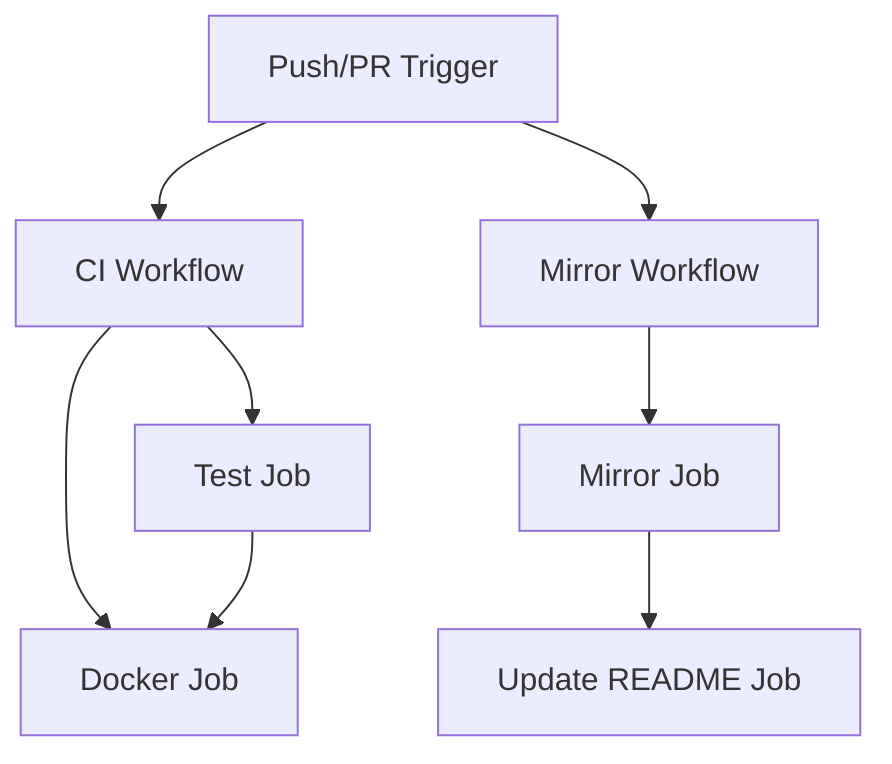

# Design Document

## Overview

This design addresses the issues in the GitHub Actions workflows for the whisper-video-to-text project. The solution involves updating the CI workflow to use correct Python versions, proper dependency management with uv, enhanced error handling, and improved security for the mirroring workflow.

## Architecture

The GitHub Actions workflows follow a standard CI/CD pattern with two main workflows:

1. **CI Workflow** (`ci.yml`): Handles testing, linting, and Docker builds
2. **Mirror Workflow** (`mirror.yml`): Handles repository mirroring to GitLab

### Workflow Dependencies



## Components and Interfaces

### CI Workflow Components

#### Test Matrix Configuration
- **Python Versions**: 3.9, 3.10, 3.11, 3.12 (removing 3.8 for compatibility)
- **Operating System**: ubuntu-latest
- **Strategy**: Matrix build for parallel testing

#### Dependency Management
- **Package Manager**: uv (modern Python package manager)
- **Installation Strategy**: `uv sync --all-extras` for comprehensive dependency installation
- **System Dependencies**: ffmpeg via apt-get

#### Quality Assurance
- **Testing Framework**: pytest with coverage
- **Linting Tools**: ruff (fast Python linter) and black (code formatter)
- **CLI Testing**: Functional tests for command-line interface

### Mirror Workflow Components

#### Security Model
- **Credential Management**: GitHub Secrets for GitLab authentication
- **Git Configuration**: Temporary bot user configuration
- **Remote Management**: Dynamic GitLab remote addition

#### Synchronization Strategy
- **Branch Sync**: All branches with force push
- **Tag Sync**: All tags with force push
- **Pruning**: Remove deleted branches/tags

## Data Models

### Workflow Configuration Schema

```yaml
# CI Workflow Structure
name: CI
on: [push, pull_request]
jobs:
  test:
    strategy:
      matrix:
        python-version: [3.9, 3.10, 3.11, 3.12]
    steps: [checkout, system-deps, python-setup, uv-install, deps-install, test, lint, cli-test]
  
  docker:
    needs: test
    steps: [checkout, docker-build, docker-test]
```

### Environment Variables and Secrets

```yaml
# Required Secrets
GITLAB_USERNAME: GitLab username for mirroring
GITLAB_TOKEN: GitLab personal access token

# Environment Variables
GITHUB_PATH: System PATH for tool installation
```

## Error Handling

### CI Workflow Error Handling

1. **Dependency Installation Failures**
   - Check uv installation success before proceeding
   - Provide clear error messages for missing system dependencies
   - Fail fast on critical dependency failures

2. **Test Failures**
   - Continue with linting even if tests fail (for comprehensive feedback)
   - Provide detailed pytest output for debugging
   - Separate test and lint job failures

3. **Docker Build Failures**
   - Only run Docker job if tests pass
   - Provide build context and error logs
   - Test container functionality after successful build

### Mirror Workflow Error Handling

1. **Authentication Failures**
   - Check for required secrets before attempting operations
   - Provide clear error messages for missing credentials
   - Graceful handling of GitLab API rate limits

2. **Git Operation Failures**
   - Handle force push conflicts appropriately
   - Retry logic for transient network issues
   - Clear error reporting for permission issues

3. **README Update Failures**
   - Check if badges already exist before modification
   - Handle git commit failures gracefully
   - Only run if mirror operation succeeds

## Testing Strategy

### CI Workflow Testing

1. **Unit Testing**
   - Test core functionality with pytest
   - Include coverage reporting
   - Test across all supported Python versions

2. **Integration Testing**
   - CLI functionality testing
   - Docker container testing
   - End-to-end workflow validation

3. **Code Quality Testing**
   - Linting with ruff for code quality
   - Formatting checks with black
   - Import sorting and style consistency

### Mirror Workflow Testing

1. **Dry Run Testing**
   - Test git operations without actual push
   - Validate credential handling
   - Test README badge detection logic

2. **Security Testing**
   - Ensure secrets are not exposed in logs
   - Validate secure credential handling
   - Test authentication error scenarios

## Implementation Considerations

### Performance Optimizations

1. **Parallel Execution**
   - Matrix builds for Python versions
   - Concurrent job execution where possible
   - Efficient caching strategies

2. **Resource Management**
   - Appropriate runner selection
   - Efficient Docker layer caching
   - Minimal dependency installation

### Security Considerations

1. **Credential Management**
   - Use GitHub Secrets for sensitive data
   - Avoid credential exposure in logs
   - Principle of least privilege for tokens

2. **Code Injection Prevention**
   - Validate inputs in shell commands
   - Use proper quoting for variables
   - Avoid dynamic script generation

### Maintainability

1. **Clear Documentation**
   - Inline comments for complex operations
   - Clear step names and descriptions
   - Comprehensive error messages

2. **Version Management**
   - Pin action versions for stability
   - Regular updates for security patches
   - Clear upgrade paths for dependencies
