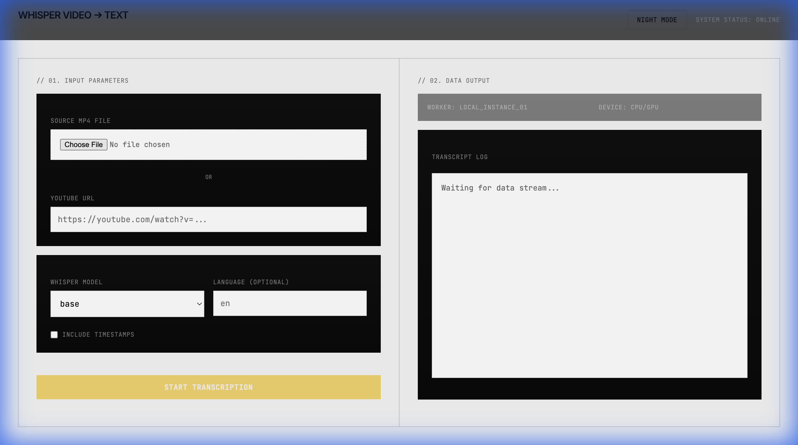

# Whisper Video ► Text

[](https://python.org/)
[](LICENSE.txt)
[](https://github.com/daryllundy/whisper-video-to-text/actions/workflows/ci.yml)

Convert MP4 videos (local or YouTube) to accurate, timestamped text using OpenAI Whisper locally.

## 🎥 Demo

Check out the CLI in action: [demo.cast](demo.cast) (view with `asciinema play demo.cast`)

## ⚡ Quick Start

### Installation

We recommend using [uv](https://github.com/astral-sh/uv) for fast, reliable Python management.

**Using uv (Recommended)**
```bash
git clone https://github.com/daryllundy/whisper-video-to-text.git
cd whisper-video-to-text
uv venv && source .venv/bin/activate
uv pip install -e .
```

**Using pip**
```bash
pip install .
```

*Note: Requires `ffmpeg` installed on your system.*

### Usage

**Transcribe a local video**
```bash
whisper_video_to_text video.mp4
```

**Download & Transcribe YouTube**
```bash
whisper_video_to_text "https://youtube.com/watch?v=..." --download
```

## 🛠 CLI Options

| Flag | Description | Example |
|------|-------------|---------|
| `--model` | Whisper model size (`tiny`, `base`, `small`, `medium`, `large`) | `--model medium` |
| `--language` | Spoken language code | `--language en` |
| `--format` | Output format (`txt`, `srt`, `vtt`) | `--format srt` |
| `--timestamps` | Include timestamps in text output | `--timestamps` |
| `--output` | Custom output path | `--output transcript.txt` |
| `--download` | Download video from URL | `URL --download` |

## 🌐 Web Interface

Includes a modern FastAPI web UI.



```bash
# Install web dependencies
uv pip install .[web]

# Run server
uv run python -m whisper_video_to_text.web.main
```
Visit http://localhost:8000.

## 🐳 Docker

**Run CLI**
```bash
docker build -t whisper-v2t .
docker run --rm -v "$PWD:/workspace" whisper-v2t /workspace/video.mp4
```

**Run Web UI**
```bash
docker-compose up -d
```

## 💻 Development

See [CONTRIBUTING.md](CONTRIBUTING.md) for details.

```bash
make test        # Run tests
make lint        # Run linter
make typecheck   # Run mypy
```
