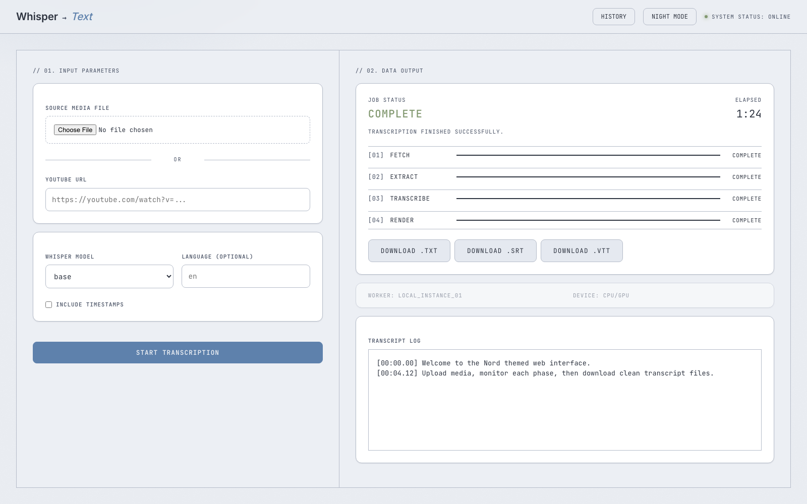
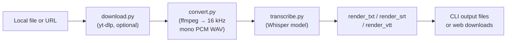

# Whisper Video to Text

[](https://python.org/)
[](LICENSE.txt)
[](https://github.com/daryllundy/whisper-video-to-text/actions/workflows/ci.yml)

Local-first transcription for media files and YouTube videos using OpenAI Whisper — no API keys, no uploads, runs entirely on your machine.

## Why

I needed reliable transcripts from videos, voice notes, and downloaded talks without sending audio to a cloud service. The first version was a script. This version wraps that pipeline in a proper CLI and web UI, with ffmpeg normalization, subtitle export, Docker support, and CI-backed tests — the difference between a script and a project I'd put on a resume.

## Features

- **Local inference** — Whisper runs on your hardware; nothing leaves the machine.
- **Multiple inputs** — common local audio/video files (`.mp3 .m4a .m4p .wav .mp4 .mov .webm .mkv .avi` and more) or YouTube URLs via `yt-dlp`.
- **Multiple output formats** — plain text, timestamped text, SRT subtitles, WebVTT subtitles.
- **Shared pipeline** — CLI and web UI call the same `run_transcription()` function; no duplicated logic.
- **Progress streaming** — web UI streams live status via Server-Sent Events.
- **Docker** — single image for CLI or web, with volume mounts for transcripts and model cache.

## Install

Requires `ffmpeg` on your system PATH.

```bash
git clone https://github.com/daryllundy/whisper-video-to-text.git
cd whisper-video-to-text
uv venv && source .venv/bin/activate
uv pip install -e .
```

## CLI Usage

```bash
# Transcribe a local file (outputs .txt by default)
whisper_video_to_text video.mp4

# Download from YouTube and transcribe
whisper_video_to_text "https://youtube.com/watch?v=..." --download

# Export SRT and VTT subtitles with a larger model
whisper_video_to_text talk.mp4 --format srt --format vtt --model medium

# Include timestamps in plain text output
whisper_video_to_text audio.wav --timestamps
```

| Flag | Description |
|------|-------------|
| `--model` | Whisper model: `tiny` `base` `small` `medium` `large` (default: `base`) |
| `--language` | Language code, e.g. `en`, `es`, `fr` |
| `--format` | Output format(s): `txt` `srt` `vtt` — repeatable |
| `--timestamps` | Prefix each segment with its start time |
| `--download` | Download from URL via `yt-dlp` before transcribing |
| `--keep-audio` | Keep the intermediate WAV file |
| `--output` | Override the output base path |

## Web UI

```bash
uv pip install -e .[web]
uv run python -m whisper_video_to_text.web.main
# → http://localhost:8000
```




## Architecture


```mermaid
flowchart LR
    A["Local file or URL"] --> B["download.py\n(yt-dlp, optional)"]
    B --> C["convert.py\n(ffmpeg → 16 kHz\nmono PCM WAV)"]
    C --> D["transcribe.py\n(Whisper model)"]
    D --> E["render_txt / render_srt\n/ render_vtt"]
    E --> F["CLI output files\nor web downloads"]
```

`pipeline.py` composes the four steps into a single `run_transcription(request, progress)` call. Both `cli.py` and `web/views.py` use it — there is no separate transcription logic in the web layer. The web layer adds FastAPI routing, file upload handling, SSE progress streaming (`web/progress.py`), and Jinja2 rendering.

`render_srt`, `render_vtt`, and `render_txt` in `transcribe.py` return strings; `save_srt` and `save_vtt` write those strings to disk. The render functions are pure and testable without a filesystem.

## Design Decisions

**Local inference only.** Whisper runs on the host machine. No API keys, no audio leaves the environment. Everything else follows from this.

**ffmpeg for normalization.** Whisper works best on 16 kHz mono PCM audio. ffmpeg converts any supported input into consistent WAV before transcription rather than handling codec variants in Python. `ffmpeg-python` is an optional dependency used only for the progress-bar duration probe — its absence is handled gracefully.

**Progressive MP4 before adaptive.** `yt-dlp` tries a single-file MP4 stream first, then falls back to separate video/audio streams. This ordering avoids HTTP 403 errors that adaptive streams sometimes produce on current YouTube responses.

**In-memory job state.** `web/progress.py` stores job progress in a dict backed by asyncio queues. For a local single-process tool this is simple and correct. A multi-worker deployment would need Redis or a database backend — this is documented at the top of `progress.py` and in [Limitations](#limitations).

## Development

```bash
uv pip install -e .[dev,web]

make lint        # ruff + black check
make format      # ruff --fix + black
make typecheck   # mypy whisper_video_to_text
make test        # pytest -v

pytest tests/test_pipeline.py -v   # pipeline tests only
```

CI runs lint → mypy → tests (Python 3.9 and 3.12 matrix) → Docker build. Tests mock ffmpeg, yt-dlp, and Whisper — no network or large files required.

## Docker

```bash
# CLI
docker build -t whisper-v2t .
docker run --rm -v "$PWD:/workspace" whisper-v2t /workspace/audio.wav

# Web UI
docker compose up -d
# → http://localhost:8000
```

Named volumes keep transcripts and the Whisper model cache across container restarts.

## Limitations

- **Single-process web UI.** The in-memory job store doesn't survive restarts or scale across workers. Suitable for local use; needs Redis or a database backend for anything beyond that.
- **System ffmpeg required.** ffmpeg must be on the host PATH. Vendoring it would add substantial per-platform maintenance overhead.
- **DRM-protected media.** Supported extensions still need to be decodable by ffmpeg. Encrypted `.m4p` files may fail even though unprotected `.m4p` audio is accepted.
- **YouTube availability.** URL downloads depend on `yt-dlp` and current YouTube format availability. The format fallback handles common cases but cannot guarantee every URL will work.
- **Transcription accuracy.** Whisper quality varies by model size, audio quality, and language. The `large` model is most accurate but requires significantly more memory and time.
