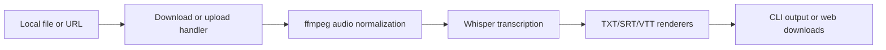

# Whisper Video to Text Project Handoff

This document turns the portfolio review into an implementation handoff. The goal is to make the project read as intentionally engineered: a local-first transcription tool with a coherent architecture, clear tradeoffs, working quality gates, and a strong write-up.

## Recommended Direction

Do not rebuild from scratch yet. The project already has a useful core: a packaged Python CLI, FastAPI web UI, Docker support, CI, tests, and screenshots. A full rewrite would spend effort hiding history instead of strengthening the actual signal.

The better path is a focused consolidation pass:

1. Fix credibility blockers.
2. Reduce duplicated logic.
3. Make CLI and web share the same pipeline.
4. Replace weak tests with behavior tests.
5. Rewrite the README and publish a blog post that explains the engineering choices.

## Current Signals

Positive signals:

- Packaged Python project with CLI entry points.
- Local Whisper transcription with no API keys required.
- ffmpeg-based media normalization.
- YouTube download support through `yt-dlp`.
- Multiple output formats: TXT, SRT, VTT.
- FastAPI web interface with progress events.
- Dockerfile and compose workflow.
- GitHub Actions CI for lint, tests, and Docker image validation.
- Test suite with external tools mocked.

Weak signals to fix:

- `pyproject.toml` still contains placeholder author metadata.
- `make typecheck` is documented, but mypy currently fails.
- CI does not run mypy even though the project advertises type checking.
- Web layer duplicates subtitle formatting logic that already belongs in the transcription/output layer.
- Some tests inspect source text instead of behavior.
- Large demo media files are tracked in the repo.
- README explains usage, but not the engineering decisions or limitations.
- The web job state is explicitly single-process only, which is fine for a local tool but should be framed clearly.

## Ordered Fix Plan

### 1. Fix Package Metadata

Files:

- `pyproject.toml`
- `README.md`

Tasks:

- Replace placeholder author fields with real project metadata.
- Add missing project fields if publishing is a goal: `license`, `keywords`, `classifiers`, and project URLs.
- Align the package description with the current functionality. It now supports more than MP4.

Suggested description:

```toml
description = "Local-first media transcription with Whisper, ffmpeg normalization, YouTube downloads, and TXT/SRT/VTT output."
```

Done when:

- `pyproject.toml` no longer contains `Your Name` or placeholder email.
- Package metadata describes the actual project scope.

### 2. Make Type Checking Real

Files:

- `whisper_video_to_text/cli.py`
- `whisper_video_to_text/convert.py`
- `whisper_video_to_text/web/views.py`
- `.github/workflows/ci.yml`

Tasks:

- Add `-> None` to `cli.main`.
- Type logging handlers as `list[logging.Handler]`.
- Fix the optional `ffmpeg` import typing in `convert.py`.
- Guard iteration over `process.stderr` after `subprocess.Popen`.
- Normalize form values in `web/views.py` before passing them to `BackgroundTasks`.
- Add `uv run mypy whisper_video_to_text` to CI.

Known current failures:

```text
whisper_video_to_text/convert.py:14: error: Unused "type: ignore" comment
whisper_video_to_text/convert.py:41: error: Item "None" of "Optional[IO[str]]" has no attribute "__iter__"
whisper_video_to_text/cli.py:17: error: Function is missing a return type annotation
whisper_video_to_text/cli.py:88: error: Argument 1 to "append" of "list" has incompatible type "FileHandler"
whisper_video_to_text/web/views.py:42: error: Function is missing a return type annotation
whisper_video_to_text/web/views.py:265: error: Argument "file" to "add_task" has incompatible type
whisper_video_to_text/web/views.py:266: error: Argument "url" to "add_task" has incompatible type
whisper_video_to_text/web/views.py:269: error: Argument "formats" to "add_task" has incompatible type
```

Done when:

- `uv run mypy whisper_video_to_text` passes locally.
- CI runs mypy before tests or in the lint job.
- `make typecheck` is truthful.

### 3. Remove Large Demo Media From Git

Files:

- `examples/neuro-spicy-ai.MP4`
- `examples/ai-warning.MP4`
- `demo.gif`
- `.gitignore`
- `README.md`

Tasks:

- Remove large video files from the repository history going forward.
- Keep screenshots in `docs/images/`.
- Move demo media to GitHub Releases, external storage, or Git LFS if preserving them matters.
- Keep one tiny synthetic test fixture only if needed.
- Update README demo links accordingly.

Done when:

- Regular clone size is small.
- `.gitignore` prevents future generated media and transcripts.
- Demo media is referenced from a stable external location if still needed.

### 4. Centralize Output Formatting

Files:

- `whisper_video_to_text/transcribe.py`
- `whisper_video_to_text/web/views.py`
- tests under `tests/`

Tasks:

- Move all TXT/SRT/VTT rendering into shared functions in `transcribe.py` or a new `outputs.py`.
- Make `save_transcription`, `save_srt`, and `save_vtt` call those render functions.
- Make the web layer use the same render functions instead of rebuilding SRT/VTT strings.
- Remove duplicate `_format_srt_time` and `_format_vtt_time` from `web/views.py`.

Suggested shape:

```python
def render_txt(transcription: dict[str, Any], include_timestamps: bool = False) -> str: ...
def render_srt(transcription: dict[str, Any]) -> str: ...
def render_vtt(transcription: dict[str, Any]) -> str: ...
def save_text(content: str, output_file: str) -> None: ...
```

Done when:

- CLI and web produce matching output for the same transcription result.
- Formatter tests cover TXT, timestamped TXT, SRT, and VTT.
- No subtitle formatting code remains in `web/views.py`.

### 5. Introduce a Shared Transcription Pipeline

Files:

- New file, likely `whisper_video_to_text/pipeline.py`
- `whisper_video_to_text/cli.py`
- `whisper_video_to_text/web/views.py`
- tests under `tests/`

Tasks:

- Create a single orchestration function or class for transcription jobs.
- Let CLI and web provide different inputs and progress callbacks, but share the same work.
- Keep FastAPI-specific code in the web layer.
- Keep argparse-specific code in the CLI layer.

Suggested shape:

```python
@dataclass
class TranscriptionRequest:
    source: str
    download: bool = False
    model: str = "base"
    language: str | None = None
    formats: tuple[str, ...] = ("txt",)
    include_timestamps: bool = False
    keep_audio: bool = False
    output_base: Path | None = None


def run_transcription(
    request: TranscriptionRequest,
    progress: Callable[[int, str, str], None] | None = None,
) -> TranscriptionResult:
    ...
```

Done when:

- The CLI no longer manually sequences download, conversion, transcription, and output writing.
- The web background task delegates core work to the shared pipeline.
- Tests can exercise the pipeline without invoking FastAPI or argparse.

### 6. Replace Source-Text Tests With Behavior Tests

Files:

- `tests/test_deeper_refactors.py`
- `tests/test_web_media_formats.py`
- New focused tests as needed.

Tasks:

- Replace tests that search source strings with tests that call behavior.
- Add FastAPI `TestClient` tests for web routes where practical.
- Add unit tests around form parsing and job creation.
- Add golden output tests for renderers.
- Keep external tools mocked.

Done when:

- Tests fail because behavior regressed, not because a string moved.
- Test names describe user-visible behavior.
- Coverage is focused around the pipeline and output formats.

### 7. Clarify Web Runtime Boundaries

Files:

- `whisper_video_to_text/web/progress.py`
- `README.md`
- possibly `docker-compose.yml`

Tasks:

- Keep the in-memory job store for local/single-worker use.
- Document that multi-worker deployment would require Redis or durable storage.
- Consider moving upload/transcript directories into configurable settings.
- Validate uploads by extension before saving.
- Consider generating job-scoped upload filenames instead of reusing the original filename.

Done when:

- README clearly frames the web UI as local/single-user unless upgraded.
- Upload handling cannot overwrite an existing file with the same name.
- Job state limitations are explicit.

### 8. Tighten Docker And Compose

Files:

- `Dockerfile`
- `docker-compose.yml`
- `docker-compose.dev.yml`
- `README.md`

Tasks:

- Make README and compose agree on the port.
- Avoid surprising port defaults. Use `8000` unless there is a strong reason for `8001`.
- Make health checks match the configured port.
- Keep non-root user and cache directories.
- Consider using a fixed uv image tag instead of `latest`.

Done when:

- `docker compose up` starts the web UI on the documented URL.
- CI validates the Docker image.
- README includes both CLI and web Docker examples.

### 9. Rewrite README Around Engineering Decisions

Files:

- `README.md`

Tasks:

- Start with the value proposition in one sentence.
- Show CLI and web usage quickly.
- Add an "Architecture" section.
- Add a "Design Decisions" section.
- Add a "Limitations" section.
- Add a "Quality" section with tests, CI, Docker, and type checking.
- Keep screenshots, but avoid making the UI polish the main story.

Suggested README structure:

```text
# Whisper Video to Text

Local-first transcription for media files and YouTube videos using Whisper.

## Why
## Features
## Install
## CLI Usage
## Web UI
## Architecture
## Design Decisions
## Development
## Docker
## Limitations
```

Done when:

- A reviewer can understand what is technically interesting in under two minutes.
- The README does not overclaim production-readiness.
- The project sounds deliberate rather than generated.

### 10. Add A Short Architecture Diagram

Files:

- `README.md`
- optionally `docs/architecture.md`

Tasks:

- Include a simple flow diagram.
- Keep it text-based or Mermaid.

Suggested diagram:



Done when:

- The shared pipeline is visible in the docs.
- The diagram reflects actual code boundaries.

### 11. Add A Small End-To-End Smoke Test

Files:

- `tests/`

Tasks:

- Generate a tiny WAV fixture during the test or keep a very small fixture.
- Mock Whisper model loading and transcription.
- Let ffmpeg conversion be mocked in unit tests.
- Optionally add one local-only integration test marker for real ffmpeg.

Done when:

- The pipeline is tested from request object to output file.
- The test remains fast and deterministic in CI.

### 12. Prepare Resume And Blog Positioning

Files:

- `README.md`
- `docs/project-handoff.md`
- eventual blog post destination

Resume bullet:

```text
Built a local-first Python transcription tool that converts local media and YouTube sources into TXT/SRT/VTT using Whisper, with ffmpeg audio normalization, FastAPI progress streaming, Docker deployment, and CI-backed tests across Python versions.
```

Short portfolio blurb:

```text
Whisper Video to Text is a local-first transcription utility I built after repeatedly needing reliable transcripts from videos, voice notes, and downloaded talks. It packages a practical media pipeline behind both a CLI and a FastAPI web UI, with ffmpeg normalization, Whisper inference, subtitle export, Docker support, and mocked tests for external tools.
```

Done when:

- Resume bullet is factual and specific.
- Blog post links to the repo after the credibility blockers are fixed.

## Suggested Commit Sequence

1. `chore: clean up package metadata`
2. `fix: make type checking pass`
3. `ci: run mypy in github actions`
4. `refactor: centralize transcript renderers`
5. `refactor: share transcription pipeline between cli and web`
6. `test: replace source checks with behavior tests`
7. `docs: rewrite readme around architecture and tradeoffs`
8. `chore: remove large demo media from repository`
9. `docs: add portfolio blog draft`

## Verification Checklist

Run before calling the project portfolio-ready:

```bash
uv run ruff check .
uv run black --check .
uv run mypy whisper_video_to_text
uv run pytest -v --tb=short --durations=10
docker build -t whisper-video-to-text:local .
docker run --rm whisper-video-to-text:local --help
```

Optional web check:

```bash
uv pip install -e .[web]
uv run python -m whisper_video_to_text.web.main
```

Then visit `http://localhost:8000`.

## Blog Post Draft

# Turning a Daily Script Into a Portfolio-Grade Python Tool

I started this project the way a lot of useful tools start: I had a repetitive problem, a few working commands, and just enough annoyance to automate it.

I often needed transcripts from videos, voice notes, downloaded talks, and short clips. I did not want to upload private audio to a hosted service, and I did not want to repeat the same `ffmpeg`, Whisper, and file-renaming steps every time. The first version solved that problem for me. It accepted a media file, extracted audio, ran Whisper locally, and saved text.

That was enough for daily use. It was not enough for a portfolio project.

The gap between "it works on my machine" and "this demonstrates engineering judgment" is not about adding more features. It is about making the boundaries clear, making the tradeoffs explicit, and proving that the boring paths work.

## The Problem

The core workflow is simple:

1. Accept a local media file or a video URL.
2. Normalize the input into audio Whisper can handle reliably.
3. Run local transcription.
4. Save the output in formats that are useful for downstream work.

In practice, each step has edge cases.

Media files arrive as MP3, WAV, MOV, MP4, AIFF, and other variants. YouTube downloads can fail depending on available formats. Whisper works best when input audio is normalized. Plain text is useful for notes, but subtitles need SRT or VTT timestamps. A command-line tool is efficient for repeated use, while a web UI is friendlier for reviewing transcripts and downloading outputs.

The project became useful when it stopped being a single script and became a small pipeline.

## Design Goals

I used four constraints to guide the refactor.

First, transcription should run locally. That keeps private audio private and removes the need for API keys.

Second, the CLI and web UI should share the same core behavior. Two interfaces should not mean two implementations of transcription, formatting, or file handling.

Third, external tools should be isolated. `ffmpeg`, `yt-dlp`, and Whisper are powerful dependencies, but tests should not need network access, GPU availability, or large media files.

Fourth, the project should be honest about its scope. This is a local-first utility, not a multi-tenant transcription platform. The web UI can use in-memory job progress for a single process, as long as that limitation is documented.

## The Pipeline

The core architecture is:

```text
local file or URL
  -> download/upload handling
  -> ffmpeg audio normalization
  -> Whisper transcription
  -> TXT/SRT/VTT rendering
  -> CLI files or web downloads
```

The important part is not that each step exists. The important part is that each step has a clear owner.

The download layer handles `yt-dlp` and fallback format selection. The conversion layer handles ffmpeg commands and produces Whisper-ready WAV files. The transcription layer loads the model and returns structured segment data. The output layer turns that structure into text, SRT, or VTT. The CLI and web app should orchestrate these pieces, not reimplement them.

That separation makes the project easier to test and easier to explain.

## What Made The First Version Feel Messy

The original project grew through practical additions: first a CLI, then YouTube download support, then subtitle formats, then a web interface, then Docker. Each addition made the tool more useful, but it also increased the chance that logic would be duplicated across layers.

The clearest example was subtitle formatting. The CLI had output functions, and the web layer built similar SRT and VTT strings itself. That is a small smell, but portfolio reviewers notice small smells because they suggest how the project might scale.

Another issue was quality signaling. The README listed `make typecheck`, but type checking did not pass locally and CI did not run mypy. That kind of mismatch is easy to fix, but it matters because it undermines trust.

The goal of the cleanup was not to make the project bigger. It was to make the claims true.

## Testing Strategy

Testing a media transcription tool can get expensive and flaky if every test invokes real external tools. I treated external programs as integration boundaries.

Unit tests mock Whisper model loading, `ffmpeg`, and `yt-dlp`. That keeps the core suite fast and deterministic. Formatter tests use small transcription dictionaries and assert exact TXT, SRT, and VTT output. Pipeline tests can verify orchestration without requiring network access or large media.

For confidence outside unit tests, CI builds the Docker image and validates that the package imports, the CLI help works, and ffmpeg exists in the image.

That combination gives useful coverage without pretending the test suite proves Whisper's model quality.

## Tradeoffs

The web UI currently uses in-memory job state. For a local single-user tool, that is acceptable and simple. For a multi-worker deployment, it would need Redis, a database, or another durable job backend.

The project also depends on system ffmpeg. Vendoring ffmpeg would make setup heavier and create platform-specific maintenance work. Requiring ffmpeg in the environment is the right tradeoff for a developer-focused utility.

YouTube download support is inherently dependent on `yt-dlp` and changing platform behavior. The code handles common format fallback cases, but the README should be clear that URL downloads depend on upstream availability.

## What I Would Improve Next

The next version should focus on consolidation rather than new features.

I would make type checking part of CI, centralize all output rendering, and move the full transcription workflow into a shared pipeline that both CLI and web routes call. I would also replace source-inspection tests with behavior tests and remove large demo media from the repository.

After that, useful feature work becomes easier: batch transcription, richer metadata output, speaker diarization experiments, or a queue-backed web deployment.

## What This Project Demonstrates

This project is not interesting because it calls Whisper. Calling a model is the easy part.

The useful engineering work is around the model: normalizing messy media inputs, isolating external tools, designing a CLI that supports repeated use, exposing the same pipeline through a web UI, writing tests that do not depend on network or large files, and documenting the limitations honestly.

That is the difference between a script and a project I am comfortable putting on a resume.

## Final Version Summary

Whisper Video to Text is a local-first transcription utility for turning media files and YouTube videos into text and subtitle files. It uses ffmpeg for audio normalization, Whisper for local inference, `yt-dlp` for optional downloads, and shared output renderers for TXT, SRT, and VTT. It includes a CLI, FastAPI web UI, Docker support, and CI-backed tests.

The project started as a daily-use experiment. The refactor made it legible as engineering work.

